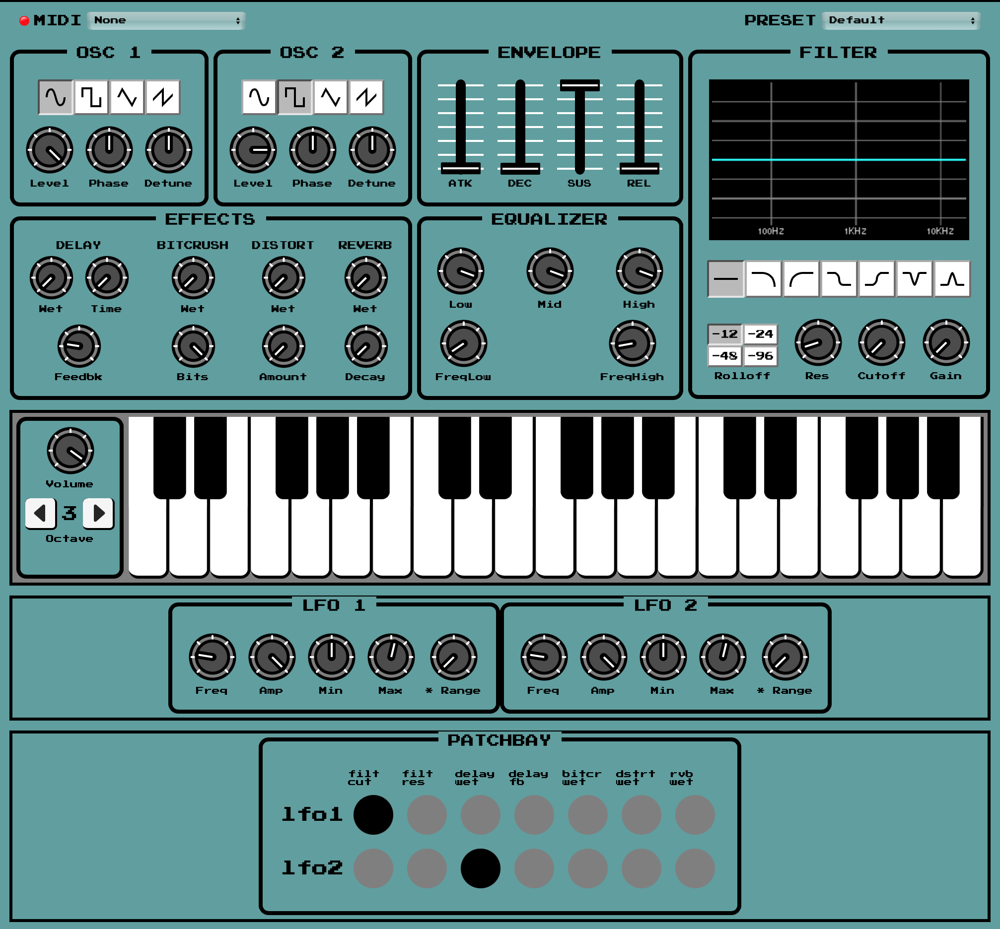

# Semi-Modular Web Synth

## Ungerecht's web synth with a matrix patchbay and new modules

Pressing a dot in the grid will route the signal from the module indicated on the left to the synth parameter indicated on top.

Careful, sending signals that are out of a parameter's range might result in loud output. I'm working on a safeguard so that at least the webpage's audio output does not break. You may need to refresh. Heck, in-range signals can get loud too: not a bug.

The keyboard doesn't work on some touchscreens. Not an issue I introduced, but I might like to fix it. I think it might be related to touchstop event since the keyboard works fine if you hold touch on certain empty areas of the UI.

More modules and more patchbay rows and columns are coming soon! 

